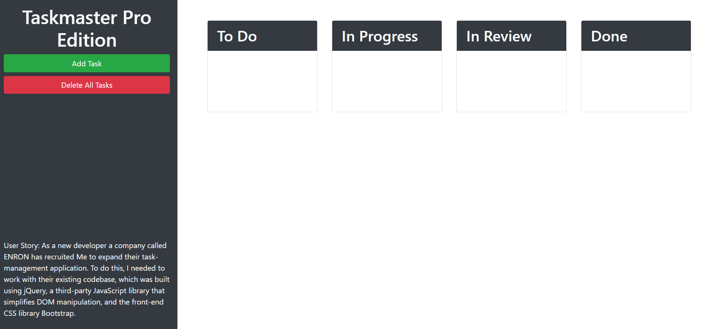

# Task Master
## User Story: As a new developer a company called ENRON has recruited Me to expand their task-management application. To do this, I needed to work with their existing codebase, which was built using jQuery, a third-party JavaScript library that simplifies DOM manipulation, and the front-end CSS library Bootstrap.
## The user has the ability to create and move tasks to categories of To do , In Progress, In Review and Done.
#
### Screenshot Of Application

##
 License & copyright
© Andre Blankholm